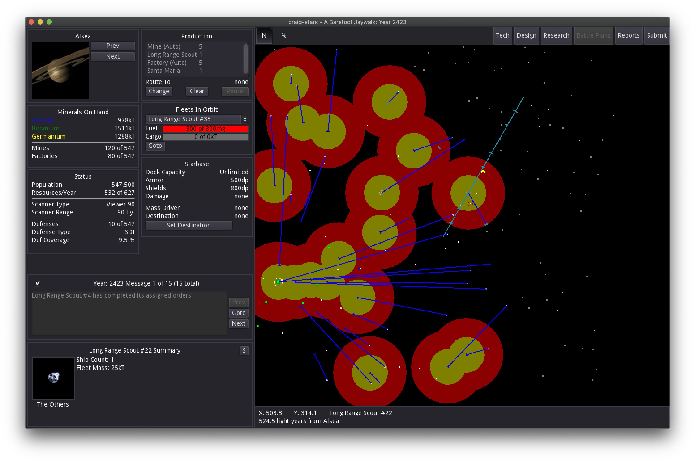

# craig-stars

A clone of the 4X game Stars!

# Development

This clone is done using the [Godot](https://godotengine.org) game engine. To launch this project, install Godot Mono 3.3 or greater (and [the required .net sdks](https://docs.godotengine.org/en/stable/getting_started/scripting/c_sharp/c_sharp_basics.html?highlight=mono#setting-up-c-for-godot)), open project.godot in the editor and click the Play button.

To run unit Core.Tests, install [.NET Core 3.1](https://dotnet.microsoft.com/download).

_... More to come on setting up a dev environment_

# Credits

-   The artwork comes from ForceUser on the [Home World Forum](https://starsautohost.org/sahforum2/index.php?t=index&rid=479)
-   The calculations for various formulas come from [The Stars! FAQ](http://starsfaq.com), FreeStars, Nova, and the Home World Forum.
-   Help setting up a multi-module c#+godot project came from [van800](https://github.com/van800/godot-demo-projects/tree/nunit/mono). Thanks!
-   Wormhole urchin graphics and portal icon are from [Hansjörg Malthaner](http://opengameart.org/users/varkalandar)

# License

The source code is licensed under the permissive MIT license. Feel free to copy and use it for whatever. The artwork and assets were created by a different team and licensed under GPL.
