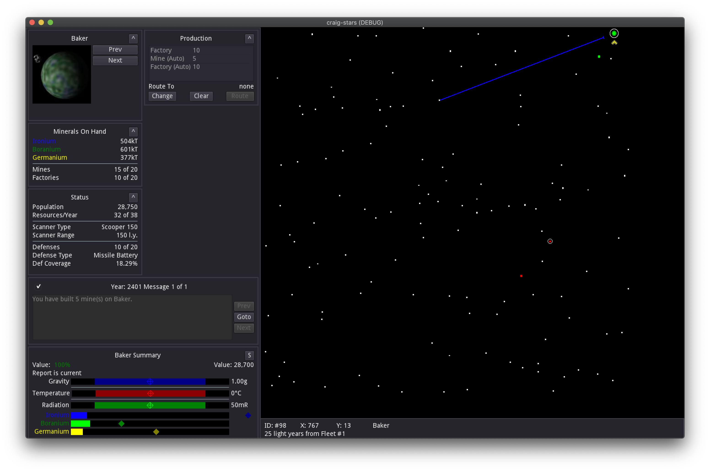

# craig-stars

An eponymous clone of the 4X game Stars!

# Mininum Viable Game

This version still isn't playable. In order to make a playable game, this clone requires:

- Scanner Views (both planetary and fleet based)
- Research Menu (partially done)
- Ship Designer
- Production Queue UI (partially done)
- Race Customizer
- Tech Browser
- Waypoint Orders (to colonize planets) (partially done)
- The rest of the Command pane tiles (for fleet management, waypoints, etc)
- Menu system (Main menu, in game exit menu, Multiplayer lobby, etc)
- Battles
- Bombing
- Invasion

# Little TODOs

There are loads of things to do, but this section is for tracking things I've implmented partially but not fully.

- Production doesn't allocate unspent resources to research
- Orbital ring colors for enemy, mixed, and friendly orbiting fleets
- Research at max level just stops, should switch to lowest unless all are max
- GR LRT not implemented
- No terraforming view on hab summary
- No cloak, jam, or initiative in ship aggregate
- Move waypoints/shift move waypoints for fine tuning

# Development

This clone is done using the [Godot](https://godotengine.org) game engine. To launch this project, install Godot Mono 3.2.3 or greater (and the required .net sdks), open project.godot in the editor and click the Play button.

_... More to come on setting up a dev environment_

# Credits

The artwork comes from ForceUser on the [Home World Forum](https://starsautohost.org/sahforum2/index.php?t=index&rid=479)
The calculations for various formulas come from [The Stars! FAQ](http://starsfaq.com), FreeStars, Nova, and the Home World Forum.

# License

The source code is licensed under the permissive MIT license. Feel free to copy and use it for whatever. The artwork and assets were created by a different team and licensed under GPL.
